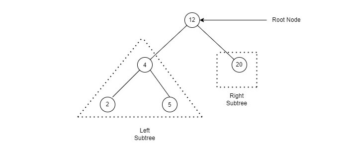

# BasicJS. Data structures

⚠️ DO NOT SUBMIT PULL REQUESTS TO THIS REPO ⚠️

#### Prerequisites

1. Install [Node.js](https://nodejs.org/en/download/)
2. Fork this repository: https://github.com/AlreadyBored/basic-js-ds
3. Clone your newly created repo: https://github.com/<%your_github_username%>/basic-js-ds
4. Go to folder `basic-js-ds`
5. To install all dependencies use [`npm install`](https://docs.npmjs.com/cli/install)
6. Run `npm run test` in command line.
7. You will see the number of pending, passing and failing tests. 100% of passing tests is equal to max score for the task

---

#### Troubleshooting

- If you catch error like [this](https://user-images.githubusercontent.com/17920285/158375305-f54d87fa-6f42-402f-af25-10b233d98cf9.png) you can try to make `npm install -g node-gyp`

---

#### Submit to [rs app](https://app.rs.school)

1. Open [rs app](https://app.rs.school) and login
2. Go to submit task page
3. Select your task (BasicJS Data Structures)
4. Press the submit button and enjoy

---

#### Notes

1. We recommend you to use Node.js of version 16.x.x LTS. If you use any of features, that does not supported by Node.js v16, there may be problems with task submit.
2. Please, be sure that each of your tests is limited to 30 sec.

---

## General task description

Your task is to deal with some data structures to solve the subtasks. Subtasks descriptions, as well as instructions on how to run tests and submit solutions are below.

---

### **Binary search tree**



A **binary tree** is a hierarchical **data structure** in which each **node** has a **value** (in this case, it is also a key) and **links** to the **left** and **right** **children**. The **node** that is at the topmost level (which is not someone else's child) is called the **root**. **Nodes** that have no children are called **leaves**.

A **binary search tree** is a **binary tree** with additional properties: the value of the **left** child is **less** than the value of the parent, and the value of the **right** child is **greater** than the value of the parent for each tree **node**. That is, the data in the binary search tree is stored sorted. Each time you **add** a new or **remove** an existing node, the sorted order of the tree is preserved. When **searching** for an element, the search value is compared with the root. If the desired is **greater** than the root, then the search continues in the **right** child of the root, if **less**, then in the **left**, if **equal**, then the value is **found** and the search stops.

Your task is to implement the class `BinarySearchTree`.
Each instance of `BinarySearchTree` must have following methods:

- `root` — return **root node** of the tree
- `add(data)` — add **node** with `data` to the tree
- `has(data)` — returns `true` if **node** with the `data` exists in the tree and `false` otherwise
- `find(data)` — returns **node** with the `data` if **node** with the `data` exists in the tree and `null` otherwise
- `remove(data)` — removes **node** with the `data` from the tree if **node** with the `data` exists
- `min` — returns **minimal** **value** stored in the tree (or `null` if tree has no **nodes**)
- `max` — returns **maximal** **value** stored in the tree (or `null` if tree has no **nodes**)

For example:

`const tree = new BinarySearchTree();`

`tree.add(1);`

`tree.add(2);`

`tree.add(3);`

`tree.add(4);`

`tree.add(5);`

`tree.root().data` => `1;`

`tree.min()` => `1`

`tree.max()` => `5`

`tree.remove(5);`

`tree.has(5)` => `false`

`tree.max()` => `4`

Write your code in `src/binary-search-tree.js`.

---

### **Remove from list**

Given a **singly linked list** of integers `l` and an integer `k`, remove all elements from list `l` that have a value equal to `k`.

For example, for `l` = `[3, 1, 2, 3, 4, 5]` and `k` = `3`,
the output should be `[1, 2, 4, 5]`

**Singly linked lists** are already defined with this interface

```js
class ListNode {
  constructor(x) {
    this.value = x;
    this.next = null;
  }
}
```

Write your code in `src/remove-from-list.js`.

---

### **Stack**

Implement the **Stack** with a given interface via **array**.

For example:

```js
const stack = new Stack();

stack.push(1); // adds the element to the stack
stack.peek(); // returns the peek, but doesn't delete it, returns 1
stack.pop(); // returns the top element from stack and deletes it, returns 1
stack.pop(); // undefined
```

Write your code in `src/stack.js`.

---

### **Queue**

Implement the **Queue** with a given interface via **linked list** (use `ListNode` extension).
Each instance of queue must have 3 methods:
_ `enqueue(value)` — puts the `value` at the end of the **queue**
_ `dequeue` — retrieves a value from the head of the **queue** and deletes it \* `getUnderlyingList` - returns underlying **linked list**

For example:

```js
const queue = new Queue();

queue.enqueue(1); // adds the element to the queue
queue.enqueue(3); // adds the element to the queue
queue.dequeue(); // returns the top element from queue and deletes it, returns 1
queue.getUnderlyingList(); // returns { value: 3, next: null }
```

Write your code in `src/queue.js`.

---

© [AlreadyBored](https://github.com/alreadybored)

& tasks:

- Remove from list
- Stack
- Queue

are integrated from [Short track 2021 repo](https://github.com/rkhaslarov/rs-school-short-track-2021)

& Thanks [mikhama](https://github.com/mikhama) for assistance!
